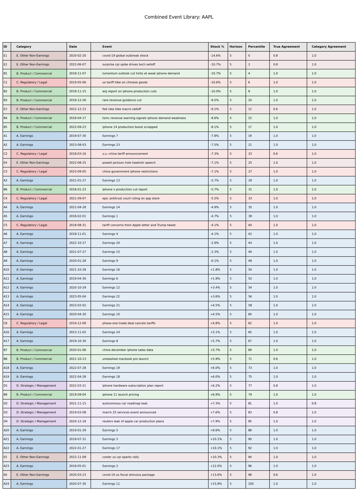

# Event-Driven Monte Carlo Price Model

This repository contains a work-in-progress model for generating forward price distributions from simulated price paths using historical event behavior.

The basic idea is to represent price movement as two pieces:

1. price changes around identifiable events
2. price movement between those events

This is a modeling choice rather than a claim about the true price process. The goal is to separate large, event-related moves from the smoother background movement that occurs between major events.

The model pipeline has been designed end-to-end, and the current implementation builds the event-window input layer. This layer extracts and classifies event windows from historical data, producing the inputs used to estimate event return distributions and run Monte Carlo simulations.

## Model Structure

The intended model has the following structure:

```text
price series
→ event windows
→ inter-event periods
→ Monte Carlo simulation
→ forward price paths
```

Event windows capture price changes around identifiable information events. Inter-event periods capture the movement between these events.

The model is intended to estimate both components from historical data rather than assuming a fixed parametric form.

## Current Implementation Status

The current implementation constructs event-window inputs from historical equity price data. The sample output uses Apple (`AAPL`) over 2018–2023.

Implemented:

- fixed-horizon return window construction
- earnings event window construction
- threshold-based selection of candidate non-earnings windows
- repeated structured event-attribution runs using the OpenAI API
- five-run majority voting for event existence and category
- event category assignment and agreement metrics
- event tables, plots, raw attribution samples, and processed event datasets

Current pipeline:

1. Build fixed-horizon return windows.
2. Select large-magnitude candidate windows.
3. Include earnings as anchor events.
4. Classify non-earnings candidate windows using structured event attribution.
5. Retain only events with stable agreement across repeated runs.
6. Produce a categorized event dataset with returns, horizons, agreement scores, and event labels.

Under development:

- event return distributions by category
- inter-event return behavior
- Monte Carlo simulation of price paths
- calibration checks against realized outcomes
- comparison with market-implied distributions where available

## Sample Diagnostics

For the current AAPL H=5 sample, 89 candidate non-earnings windows were evaluated and 28 were retained.

Among retained events, mean event-existence agreement was 90.7%, with 19 / 28 retained events receiving unanimous event agreement. Mean category agreement was 99.3%, with 27 / 28 retained events receiving full category agreement.

Across all windows with at least one event vote, mean category agreement was 97.1%.

This category agreement pattern suggests that the pipeline is not simply forcing explanations onto large price moves. Most threshold-selected windows are rejected, while retained windows show highly stable event categories across repeated runs. This indicates that meaningful event structure dominates noise in the retained set.

## Example Output

The current layer produces categorized event tables and positioning plots.



The table above is an example of the processed event-window dataset. It includes event category, approximate event date, event-window return, horizon, percentile rank, and attribution agreement metrics.

## Event Attribution

Non-earnings event labels are generated using repeated OpenAI API calls with a fixed prompt and structured output format.

Each candidate window is evaluated five times. A window is retained only if:

- a majority of runs identify an event
- a majority of runs agree on the event category

This voting step filters unstable or ambiguous classifications. The labels are treated as structured approximations used for model construction, not as definitive event attribution.

Sample raw attribution outputs are included so the voting and filtering process can be inspected.

## Event Categories

Events are grouped into broad categories:

- Earnings
- Product / Commercial
- Regulatory / Legal
- Strategic / Management
- Other Non-Earnings

Earnings are included as explicit anchor events because they occur regularly and are structurally important. Non-earnings events are included only when a large price move can be matched to a plausible dominant driver.

## Design Choices

The event extraction layer prioritizes precision over coverage.

The goal is not to label every news item. Smaller or ambiguous developments are left in the inter-event component rather than treated as separate event shocks.

Key assumptions:

- event impacts are measured over fixed short-horizon windows
- earnings and non-earnings events are treated separately
- non-earnings event inclusion depends on both price movement and identifiable catalyst
- event-window choice affects the resulting event set

## Outputs

The implemented layer produces:

- categorized event tables
- event return magnitudes
- percentile positioning plots
- agreement metrics across repeated classification runs
- sample raw attribution outputs
- processed event-window datasets for downstream distribution estimation

These outputs are intermediate model inputs, not final simulated paths.

Processed event datasets are included so the visualization notebook can be run without rerunning OpenAI API calls.

## Usage

The current implementation is notebook-based.

1. Run `01_event_extraction_pipeline.ipynb` to construct candidate event windows and apply event filtering.
2. Run `02_event_output_visualization.ipynb` to generate event tables and positioning plots.

OpenAI API access is required only if rerunning non-earnings event attribution. API keys should be supplied through environment variables and should not be committed to the repository.

## Repository Structure

```text

01_event_extraction_pipeline.ipynb
02_event_output_visualization.ipynb

data/
    aapl_h5_sample_outputs.jsonl
    aapl_h5_selected_events.json
    aapl_h5_earnings_events.json

figures/
    aapl_event_table.png
    aapl_event_positioning.png
```

The raw attribution samples are included for transparency and inspection of the attribution procedure. The processed event dataset is the cleaned input used for downstream distribution estimation and visualization.

## Roadmap

- estimate empirical return distributions by event category
- estimate inter-event return behavior from periods between identified events
- model non-earnings event arrivals using historical event frequency
- combine event arrivals, event returns, and inter-event behavior in a Monte Carlo simulation
- generate percentile bands for simulated price paths
- evaluate calibration against realized outcomes and, where available, market-implied distributions

## Future Improvements

- Cache retrieved source material so repeated attribution runs use the same evidence.
- Separate evidence retrieval from classification to reduce API cost and make attribution more reproducible.


## Implementation Notes

- Event dates are approximate because returns are measured over multi-day windows.
- Event inclusion depends on the chosen horizon and threshold.
